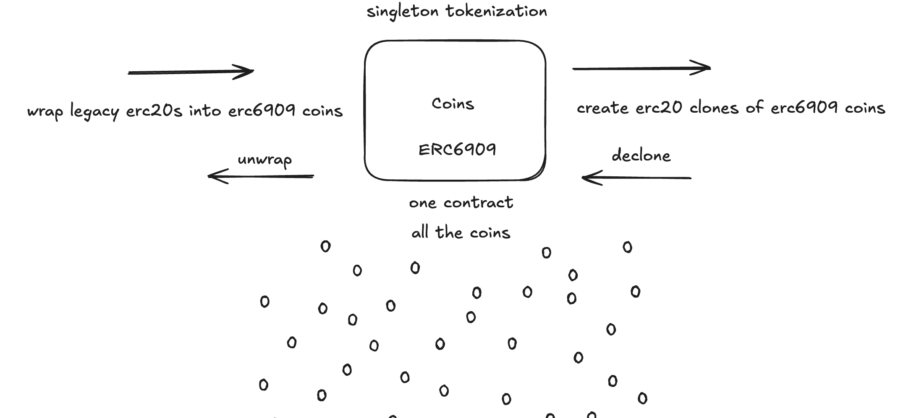

# [Coins](https://github.com/z0r0z/coins)  [](https://opensource.org/license/mit/) [](https://docs.soliditylang.org/en/v0.8.25/) [](https://getfoundry.sh/) 

Hyper-minimal fungible token singleton built on ERC6909 with two-way compatibility with ERC20.



## Getting Started

Run: `curl -L https://foundry.paradigm.xyz | bash && source ~/.bashrc && foundryup`

Build the foundry project with `forge build`. Run tests with `forge test`. Measure gas with `forge snapshot`. Format with `forge fmt`.

## GitHub Actions

Contracts will be tested and gas measured on every push and pull request.

## Blueprint

```txt
lib
├─ forge-std — https://github.com/foundry-rs/forge-std
├─ solady — https://github.com/vectorized/solady
src
├─ Coins — Coins Contract
test
└─ Coins.t - Coins Test Contract
```

## Disclaimer

*These smart contracts and testing suite are being provided as is. No guarantee, representation or warranty is being made, express or implied, as to the safety or correctness of anything provided herein or through related user interfaces. This repository and related code have not been audited and as such there can be no assurance anything will work as intended, and users may experience delays, failures, errors, omissions, loss of transmitted information or loss of funds. The creators are not liable for any of the foregoing. Users should proceed with caution and use at their own risk.*

## License

See [LICENSE](./LICENSE) for more details.
