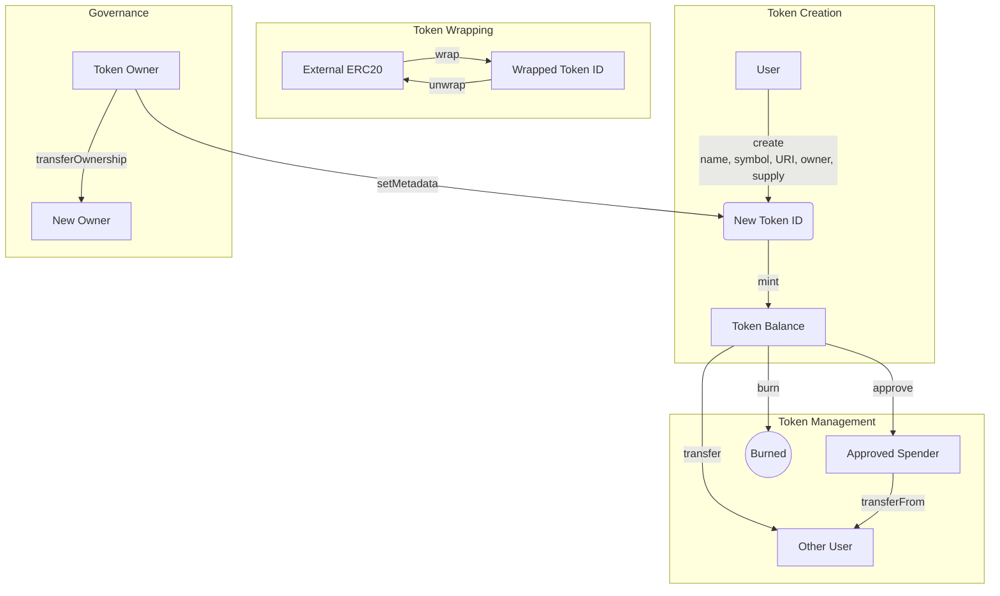

# [Coins](https://github.com/z0r0z/coins)  
[](https://opensource.org/license/mit/) 
[](https://docs.soliditylang.org/en/v0.8.25/) 
[](https://getfoundry.sh/) 
  

Hyper-minimal fungible token singleton built on ERC6909 with two-way compatibility with ERC20.


## Overview

Coins is a singleton smart contract for creating and managing fungible tokens using the ERC6909 multi-token standard. It provides a gas-efficient alternative to deploying multiple ERC20 token contracts while maintaining compatibility with the ERC20 standard.

## Deployment

Coins is deployed to [`0x0000000000009710cd229bF635c4500029651eE8`](https://contractscan.xyz/contract/0x0000000000009710cd229bF635c4500029651eE8) on every chain linked.

## Features

- **Singleton Architecture**: Create multiple token types within a single contract
- **ERC6909 Implementation**: Implements the modern multi-token standard
- **ERC20 Compatibility**: Two-way conversion between Coins tokens and ERC20 tokens
- **Metadata Support**: Name, symbol, and URI storage for each token ID
- **Token Wrapping**: Wrap existing ERC20 tokens to use within the Coins ecosystem
- **Ownership & Permissions**: Flexible permission system with ownership and operators

## Core Functionality

The diagram below provides an overview of the key functional areas of the Coins contract:



### Token Creation

```solidity
function create(
    string calldata _name,
    string calldata _symbol,
    string calldata _tokenURI,
    address owner,
    uint256 supply
) public
```

Creates a new token ID with associated metadata, owner, and initial supply. Also creates ERC20 wrapper proxy.

### Token Wrapping

```solidity
function wrap(Token token, uint256 amount) public
function unwrap(Token token, uint256 amount) public
```

Wrap existing ERC20 tokens for use within Coins, and unwrap them to retrieve the original ERC20 tokens.

### Token Management

```solidity
function mint(address to, uint256 id, uint256 amount) public
function burn(uint256 id, uint256 amount) public
```

Mint new tokens (restricted to token owner) and burn your own tokens.

### Governance

```solidity
function setMetadata(uint256 id, string calldata _tokenURI) public
function transferOwnership(uint256 id, address newOwner) public
```

Update token metadata and transfer token ownership (restricted to token owner).

### Standard ERC6909 Functions

```solidity
function transfer(address to, uint256 id, uint256 amount) public
function transferFrom(address from, address to, uint256 id, uint256 amount) public
function approve(address spender, uint256 id, uint256 amount) public
function setOperator(address operator, bool approved) public
```

Standard token operations for transfers, approvals, and operator settings.

## Token Contract

The `Token` contract is automatically created at same address as Coin ID and provides standard ERC20 functionality:

- `name()` and `symbol()`: Inherited from Coins metadata
- `approve()`, `transfer()`, `transferFrom()`: Standard ERC20 functions that call into ERC6909 transfers

## Token ID Mechanism

The Coins contract uses a deterministic approach to generate and map token IDs, which is central to how it manages both newly created tokens and existing ERC20 tokens.

### For Newly Created Coins Tokens

When you create a new coin using the `create()` function, the token ID is generated deterministically based on name and symbol.

This approach:
1. Uses the token's name and symbol as unique identifiers
2. Incorporates the Coins contract address to prevent collisions across different deployments
3. Includes the Token contract's creation code to tie the ID to the implementation
4. Follows the CREATE2 address derivation pattern, making the ID deterministic and predictable

Therefore, for any token created in the Coins system, its ID is identical to the address of its corresponding ERC20 contract.

### For Existing ERC20 Tokens

When wrapping an existing ERC20 token, the token ID is simply the address of the ERC20 token contract:

```
Wrapped Token ID = uint256(uint160(address(existingToken)))
```

This direct mapping ensures:
1. Each ERC20 token has a unique ID within the Coins system
2. The system can easily find the original token when unwrapping
3. No collision is possible between wrapped tokens and native Coins tokens

This dual-mapping approach creates a unified system where:
- Native Coins tokens can be converted to ERC20 tokens using the tokenize/untokenize functions
- External ERC20 tokens can be wrapped and used within the Coins ecosystem
- All token IDs, whether for native or wrapped tokens, correspond to valid Ethereum addresses

## Usage Examples

Here are some examples of how to interact with the Coins contract:

```solidity
// EXAMPLE 1: Creating a new token
// Deploy the Coins contract
Coins coins = new Coins();

// Create a new token with initial supply
coins.create(
    "My Token",           // name
    "MTK",                // symbol
    "ipfs://metadata",    // tokenURI
    msg.sender,           // owner
    1000000 * 10**18      // initial supply (with 18 decimals)
);
```

See the [full usage examples](./examples/CoinsExamples.sol) for more detailed code samples covering all major functions.

## Getting Started  

Run: `curl -L https://foundry.paradigm.xyz | bash && source ~/.bashrc && foundryup`  

Build the foundry project with `forge build`. Run tests with `forge test`. Measure gas with `forge snapshot`. Format with `forge fmt`.  

## GitHub Actions  

Contracts will be tested and gas measured on every push and pull request.  

## Blueprint  

```txt
lib 
├─ forge-std — https://github.com/foundry-rs/forge-std 
├─ solady — https://github.com/vectorized/solady 
src 
├─ Coins — Coins Contract 
test 
└─ Coins.t - Coins Test Contract 
```  

## Disclaimer  

*These smart contracts and testing suite are being provided as is. No guarantee, representation or warranty is being made, express or implied, as to the safety or correctness of anything provided herein or through related user interfaces. This repository and related code have not been audited and as such there can be no assurance anything will work as intended, and users may experience delays, failures, errors, omissions, loss of transmitted information or loss of funds. The creators are not liable for any of the foregoing. Users should proceed with caution and use at their own risk.*  

## License  

See [LICENSE](./LICENSE) for more details.
